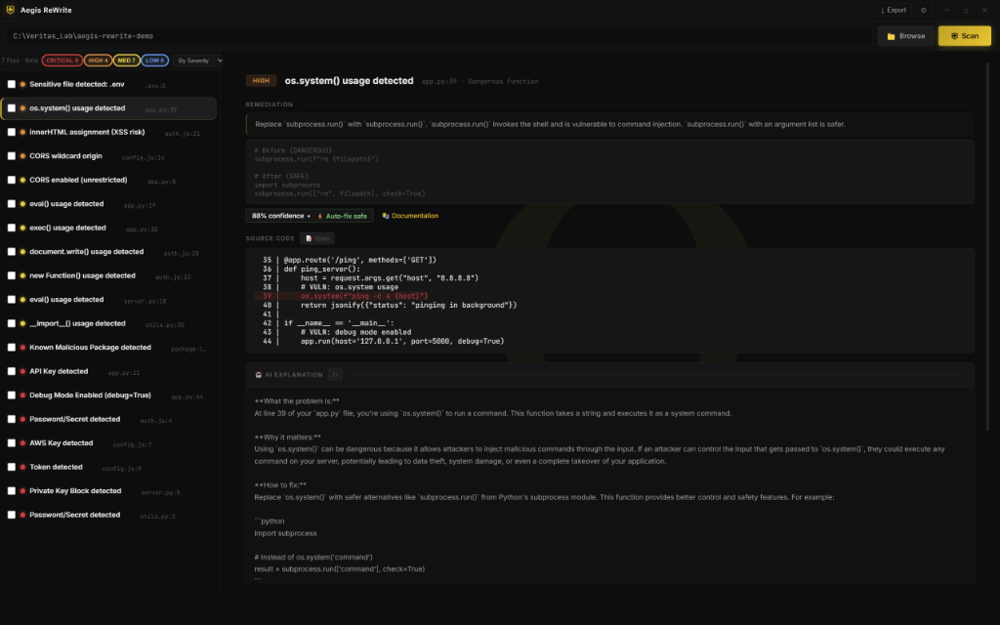
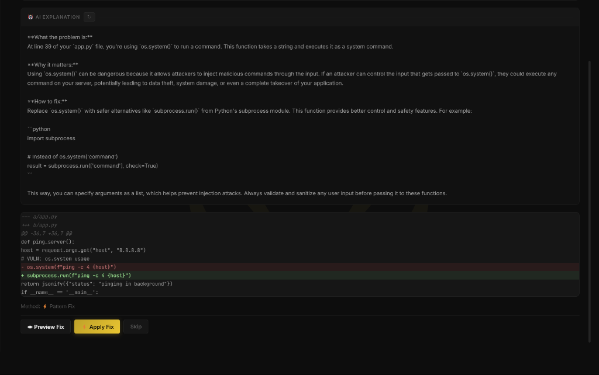

# Aegis ReWrite


**Aegis ReWrite** is a high-assurance, standalone security scanner and AI-powered remediation engine. Extracted from the core Aegis Protect platform, ReWrite operates as an independent Electron + Flask application designed to scan local codebases, provide plain-English explanations of security vulnerabilities, and apply deterministic and AI-powered fixes with a single click.

<div align="center">
  
  <br />
  <sub><i>Aegis ReWrite Dashboard detecting os.system() usage, showcasing the VERITAS gold-and-obsidian interface.</i></sub>
</div>

## Features

- **Omni-Scanning Engine**: Automatically detects vulnerabilities across multiple languages and frameworks using robust AST and regex parsing.
- **Two-Tier Remediation Pipeline**: 
  - **Tier 1 (Deterministic)**: Instant pattern-matching fixes for known signatures (e.g., stripping `eval()`, setting `shell=False`, disabling wildcard CORS).
  - **Tier 2 (AI-Powered)**: Context-aware codebase rewrites powered by local Ollama (`qwen3:8b`) models, ensuring fixes fit the codebase perfectly without relying on external APIs.
- **High-Assurance Architecture**: 
  - Enforced out-of-bounds path traversal protection (`is_safe_path` strict namespace boundaries).
  - Rollback desynchronization guards and syntax poisoning rejection (AST sanity checks before writing).
  - Redundant file I/O locks for concurrent race-condition survivability.
- **Trust Visibility UX**: Deterministic assurances are surfaced to the user. Every remediation action leaves an atomic `.aegis.bak` backup. Finding severities are cleanly separated into `Auto-fix safe`, `Review first`, and `Manual only` lenses.

<div align="center">
  
  <br />
  <sub><i>AI-powered explanation with interactive diff viewer, ensuring complete transparency before applying code fixes.</i></sub>
</div>
- **Standalone VERITAS Aesthetics**: Built with the signature VERITAS gold-and-black design language—clean, professional, and dark-mode native.

## Architecture Structure

- **Backend (`/backend`)**: A lightweight Python Flask API (`app.py` running on `:5055`). Handles file state manipulation, `file_ops` backup chains, Ollama bridging (`ai_explain.py`), and the core dispatch-table remediation logic. Uses built-in standard libraries to maintain cross-platform compatibility without heavy native dependencies like `psutil`.
- **Frontend (`/src`)**: An Electron container with a UI constructed in vanilla HTML, JS (`renderer.js`), and CSS. Interrogates the backend via IPC pathways (`preload.js`), streaming scan results and parsing diff previews natively to the interface.

## Quick Start

### Requirements
- **Node.js**: v18+
- **Python**: v3.10+
- **Ollama**: (Optional, for Tier-2 AI rewrites) with the parameter `qwen3:8b` (or equivalent) deployed locally.

### Installation

1. **Clone the repository:**
   ```bash
   git clone https://github.com/RJLopezAI/aegis-rewrite.git
   cd aegis-rewrite
   ```

2. **Install Node dependencies:**
   ```bash
   npm install
   ```

3. **Install Python dependencies:**
   ```bash
   cd backend
   pip install -r requirements.txt
   ```

### Execution

1. **Launch the Flask Backend Context:**
   ```bash
   cd backend
   python app.py
   # Starts server on http://127.0.0.1:5055
   ```

2. **Launch the Electron App:**
   In a separate terminal:
   ```bash
   npm start
   ```

## Security & Verification

Aegis ReWrite has undergone the rigorous **Destruction Campaign Wave 3** adversarial testing, proving resiliency against:
- Remediation Race Conditions (20 concurrent threads)
- Path Traversal Exploitation
- File I/O Deadlocks
- Context Window Exhaustion / Bombing
- AST Model Injection / Poisoning
- Batch Job Desynchronization

Status verified via the [VERITAS Ω-CODE v2.0 Protocol](https://github.com/VrtxOmega/VERITAS-Omega-CODE).


## 🌐 VERITAS Omega Ecosystem

This project is part of the [VERITAS Omega Universe](https://github.com/VrtxOmega/veritas-portfolio) — a sovereign AI infrastructure stack.

- [VERITAS-Omega-CODE](https://github.com/VrtxOmega/VERITAS-Omega-CODE) — Deterministic verification spec (10-gate pipeline)
- [omega-brain-mcp](https://github.com/VrtxOmega/omega-brain-mcp) — Governance MCP server (Triple-A rated on Glama)
- [Gravity-Omega](https://github.com/VrtxOmega/Gravity-Omega) — Desktop AI operator platform
- [Ollama-Omega](https://github.com/VrtxOmega/Ollama-Omega) — Ollama MCP bridge for any IDE
- [OmegaWallet](https://github.com/VrtxOmega/OmegaWallet) — Desktop Ethereum wallet (renderer-cannot-sign)
- [veritas-vault](https://github.com/VrtxOmega/veritas-vault) — Local-first AI knowledge engine
- [sovereign-arcade](https://github.com/VrtxOmega/sovereign-arcade) — 8-game arcade with VERITAS design system
- [SSWP](https://github.com/VrtxOmega/sswp-mcp) — Deterministic build attestation protocol
## License

Copyright © 2026. All rights reserved.
